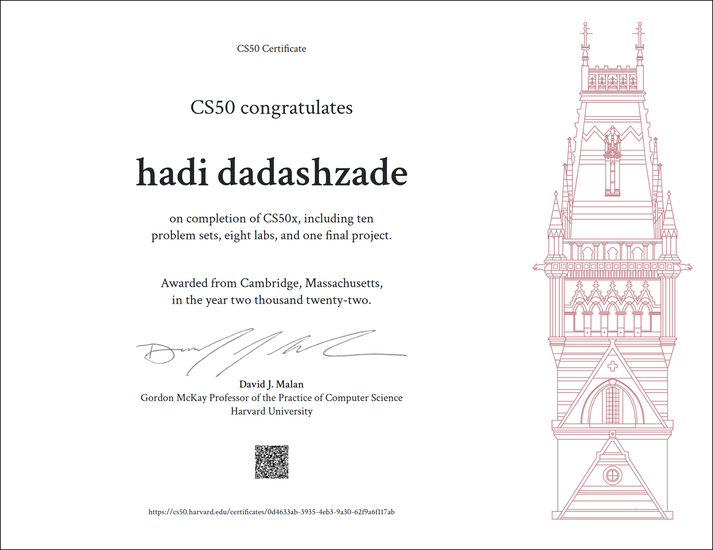

# Harvard CS50x — 2022 Solutions

- [Course Website](https://cs50.harvard.edu/x/2022/)  
- [My Certificate](https://cs50.harvard.edu/certificates/0d4633ab-3935-4eb3-9a30-62f9a6f117ab)  
- [Final Project Repository](https://github.com/hadidadashzade)

---

## About This Repository

This repository contains my personal solutions for **Harvard's CS50x 2022** course — an introduction to computer science and programming fundamentals.

Included are weekly problem sets, labs, and the final project. Some assignments are complete, and others may be added or completed later.

---

## Weekly Assignments Summary

### Week 0 – Scratch  
[Folder](./Week0)  
*Introductory projects using Scratch.*

### Week 1 – C Basics  
Completed:  
- [hello](./Week1/hello)  
- [cash](./Week1/cash)  
- [credit](./Week1/credit)  
- [mario-less](./Week1/mario-less)  

🔜 *Mario-more* pending completion.

### Week 2 – Arrays  
Completed:  
- [lab2-scrabble](./Week2/lab2/scrabble)  
- [caesar](./Week2/caesar)  
- [readability](./Week2/readability)  
- [substitution](./Week2/substitution)

### Week 3 – Algorithms  
Completed:  
- [lab3-sort](./Week3/lab3/sort)  
- [runoff](./Week3/runoff)  
- [plurality](./Week3/plurality)  

🔜 *Tideman* pending completion.

### Week 4 – Memory  
Completed:  
- [lab4-volume](./Week4/lab4/volume)  
- [recover](./Week4/recover)  
- [filter-less](./Week4/filter-less)  

🔜 *Filter-more* pending completion.

### Week 5 – Data Structures  
Completed:  
- [speller](./Week5/speller)  

🔜 *Lab 5: Inheritance* pending completion.

### Week 6 – Python  
Completed:  
- [sentimental-hello](./Week6/sentimental-hello)  
- [sentimental-readability](./Week6/sentimental-readability)  
- [DNA](./Week6/DNA)  
- [sentimental-credit](./Week6/sentimental-credit)  
- [sentimental-mario-less](./Week6/sentimental-mario-less)  

🔜 *Sentimental Mario (more)*, *Sentimental Cash*, and *Lab 6: World Cup* pending completion.

### Week 7 – SQL  
Completed:  
- [movies](./Week7/movies)  
- [fiftyville](./Week7/fiftyville)  

🔜 *Lab 7: Songs* pending completion.

### Week 8 – HTML, CSS, JavaScript  
Completed:  
- [homepage](./Week8/homepage)  

🔜 *Lab 8: Trivia* pending completion.

### Week 9 – Flask  
Completed:  
- [finance](./Week9/finance)  

🔜 *Lab 9: Birthdays* pending completion.

### Week 10 – Emoji (Final Project)  
Completed:  
- [Volume Control with Hand Detection](https://github.com/hadidadashzade)

---

## Course Completion

I completed CS50x on **August 15, 2022**.

Here is my certificate after finishing all assignments:

---

## Note on Academic Honesty

While these solutions can help guide your learning, it is crucial to attempt solving the problem sets yourself before referencing external solutions. Mastery comes from active problem-solving and persistence.

---

Thanks for visiting! Feel free to explore and learn from these solutions, and remember to prioritize your own learning journey. 🚀
